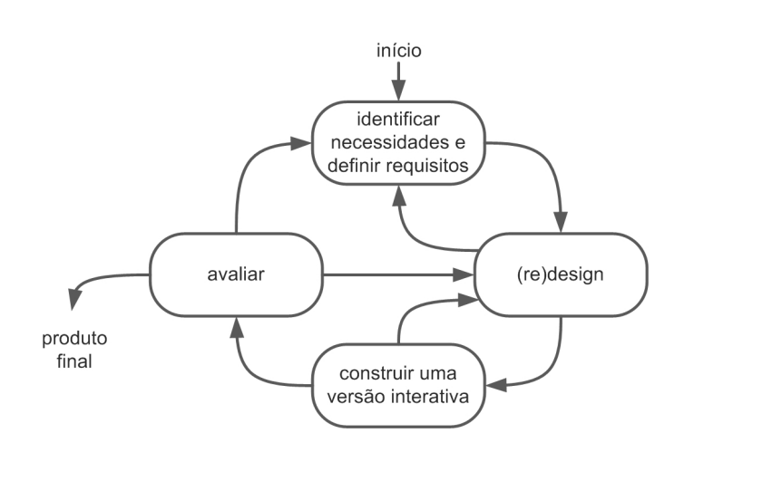
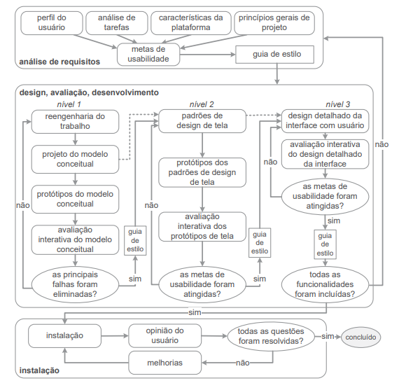

# Processo de Design

## Introdução

&emsp;&emsp;O Design, segundo Barbosa e Silva (2021, p.112)<a id="anchor_1" href="#REF1">1</a>, pode ser definido como um processo que envolve três atividades fundamentais, sendo: análise da situação atual (estudo e interpretação), síntese de uma intervenção e a avaliação da nova situação (verificação e comparação).

&emsp;&emsp;Os processos de design, portanto, são abordagens que possibilitam a execução ordenada e iterativa das tarefas já identificadas, visando criar soluções que satisfaçam as demandas dos usuários. Entre os principais modelos estão: Modelo simples, ciclo de vida em estrela, Engenharia de usabilidade de Nielsen e Ciclo de Vida de Mayhew.

&emsp;&emsp;Para o projeto atual, o modelo de design escolhido pelo grupo foi o <b>Ciclo de Vida de Mayhew</b>. Abaixo serão discutidos os quatro principais processos de design, como eles podem ser aplicados e qual foi a motivação da escolha do grupo.

## Modelos

### Ciclo de Vida Simples

&emsp;&emsp;Proposto por Preece, Sharp e Rogers<a id="anchor_2" href="#REF2">2</a>. Esse modelo tem o foco em duas atividades: design (ou redesign) e na construção de uma versão interativa.

<b>Figura 1</b> - Ciclo de Vida Simples.

<figcaption>Fonte: Preece	et	al., 2002</figcaption>

&emsp;&emsp;Durante o processo de (re)design da interação e interface, o designer explora várias ideias para criar uma solução que atenda às necessidades identificadas na análise (BARBOSA e SILVA, 2021, p.114). Esse processo resulta em descrições textuais, esboços de interface ou qualquer representação do sistema. Para avaliar o design, são criadas versões interativas que simulam a interface, facilitando a participação dos usuários na avaliação de IHC.

### Ciclo de Vida em Estrela

<b>Figura 1</b> - Ciclo de Vida em Estrela.

<figcaption>Fonte: Hix & Hartson, 1993</figcaption>

&emsp;&emsp;No ciclo de vida em estrela, o designer decide a ordem das atividades com base no contexto do projeto. Pode começar pela avaliação da versão atual para projetar uma nova versão do sistema, ou pela implementação em uma plataforma similar. 
Para um novo sistema, é comum iniciar pela análise de tarefas, usuários e funcionalidades, seguindo uma sequência iterativa. Após cada atividade, o designer avalia os resultados para garantir que está no caminho certo, sendo a avaliação uma etapa interligada entre todas as atividades.

### Engenharia de Usabilidade de Nielsen

&emsp;&emsp;Segundo Nielsen, engenharia de usabilidade é um conjunto de atividades que devem acontecer durante todo o ciclo de vida do produto, e ressalta que muitas delas ocorrem nos estágios iniciais
do projeto (BARBOSA e SILVA, 2021, p.116). A lista abaixo apresenta as atividades definidas por Nielsen em seu ciclo de vida:

- 1 - Conheça seu usuário
- 2 - Realize uma análise competitiva
- 3 - Defina as metas de usabilidade
- 4 - Faça designs paralelos
- 5 - Adote o design participativo
- 6 - Faça o design coordenado da interface como um todo
- 7 - Aplique diretrizes e análise heurística
- 8 - Faça protótipos
- 9 - Realize testes empíricos
- 10 - Pratique design iterativo

### Engenharia de Usabilidade de Mayhew

&emsp;&emsp;
A Engenharia de Usabilidade de Mayhew é um modelo estruturado para projetar e avaliar a usabilidade de sistemas interativos, esse ciclo de vida está representado na figura 1.

<b>Figura 1</b> - Atividades do Modelo de Ciclo de Vida de Mayhew.

<figcaption>Fonte: BARBOSA e SILVA, 2021, p.120.</figcaption>

Desenvolvido por Deborah Mayhew, esse modelo é composto por três etapas fundamentais:

#### Análise de requisitos

&emsp;&emsp;
Nesta fase, os engenheiros de usabilidade identificam e definem as necessidades dos usuários finais do sistema. Isso é feito através de uma variedade de métodos, como entrevistas, observações, questionários e análise de tarefas. O objetivo é compreender quem são os usuários, quais são suas metas e como eles irão interagir com o sistema. 

&emsp;&emsp;
Além disso, nesta etapa, são identificadas as restrições e os requisitos técnicos e de negócios que influenciarão o design do sistema. Isso pode incluir restrições de hardware e software, prazos, orçamentos e considerações de marca.

#### Design, avaliação, desenvolvimento

&emsp;&emsp;
Após compreender as necessidades e os requisitos dos usuários, os engenheiros de usabilidade passam para a fase de design, avaliação e desenvolvimento. Nesta etapa, são criados os artefatos de design, como protótipos e interfaces.

&emsp;&emsp;
Durante o processo de design, os engenheiros de usabilidade se concentram em criar uma interface que seja fácil de usar, eficiente e satisfatória para os usuários. Eles também garantem que o design seja consistente com as expectativas dos usuários e com as melhores práticas de design de interação.

#### Instalação

&emsp;&emsp;
Na fase final, o sistema interativo é submetido a testes de usabilidade para avaliar sua eficácia, eficiência e satisfação do usuário. Isso pode ser feito através de métodos como testes de usabilidade, análise heurística, avaliação de especialistas e feedback dos usuários.

&emsp;&emsp;
Com base nos resultados da avaliação de usabilidade, são feitas modificações no design do sistema, se necessário, para melhorar sua usabilidade. Esse ciclo de avaliação e melhoria pode ser repetido várias vezes até que o sistema atinja os padrões desejados de usabilidade.

## Motivações para a escolha

&emsp;&emsp;O grupo fez uma análise dos modelos citados anteriormente, e foi discutido suas vantagens e desvantagens para a aplicação no projeto. A conclusão foi que o Ciclo de Vida de Mayhew seria o melhor modelo por conta de suas etapas serem detalhadas e bem definidas, assim servindo de guia para uma maior assertividade no desenvolvimento do projeto.

&emsp;&emsp;Como o sistema do projeto já está ativo, iniciaremos pela etapa de instalação do Ciclo de Vida de Mayhew, identificando os problemas e respectivas melhorias que possam ser feitas, e assim progredirmos para a fase de análise de requisitos seguindo fluxo previsto no modelo.

## Bibliografia
> <a id="REF1" href="#anchor_1">1.</a>BARBOSA, S. D. J.; SILVA, B. S. Interação Humano-Computador. Rio de Janeiro: Elsevier, 2021.

> <a id="REF2" href="#anchor_2">2.</a>Sharp, Helen, Preece, Jennifer, e Rogers, Yvonne (2019). Interaction Design: Beyond Human-Computer
Interaction. John Wiley & Sons.

## Histórico de Versão

| Versão |    Data    |                Descrição                 |                    Autor(es)                     |                 Revisor(es)                  |
| ------ | ---------- | ------------------------------------------- | ------------------------------------------------ | ------------------------------------------- |
| `1.0`  | 05/04/2023 | Criação da página de Processo de Design. | [Claudio Henrique](https://github.com/claudiohsc) | [Elias](https://github.com/EliasOliver21) |
| `1.1`  | 06/04/2023 | Atualização sobre Processo de Design. | [Claudio Henrique](https://github.com/claudiohsc), [Ricardo Augusto](https://github.com/avmricardo) | [Elias](https://github.com/EliasOliver21) |
