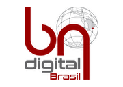

# **Sites Avaliados**
## **Introdução** 
Para aplicar os conhecimentos da disciplina de Interação Humano computador, avaliamos previamente alguns sites de software livre ou governamentais para compor o nosso projeto. As avaliações foram baseadas nas heurísticas de [Nielsen](https://www.nngroup.com/people/jakob-nielsen/) e estudadas a partir de Barbosa e Silva(2011)<a id="anchor_1" href="#REF1">1</a>.

| Aplicativo       | Descrição                                       |
|------------------|---------------------------------------------------|
|Biblioteca Nacional Digital| Site da Biblioteca Nacional Digital|
|Cebraspe| Site sobre concursos públicos, avaliações, seleções, certificações e pesquisas|
| Consumidor | Site para contato direto entre consumidor e empresas do Brasil |
| NFS-e | Site para emissão de notas fiscais |
| Núcleo de Seleção UEG| Site para coordenar os Processos Seletivos da UEG  |
| Stack Overflow| Site de perguntas e respostas na área de programação de computadores. |

***
## **Biblioteca Nacional Digital**

 Figura 1: Imagem Biblioteca Nacional Digital.
 

Fonte: <a href="https://bndigital.bn.gov.br">Biblioteca Nacional Digital</a>

### Sobre o site

O site da [Biblioteca Nacional Digital](https://bndigital.bn.gov.br) (BNDigital) é uma iniciativa da Biblioteca Nacional do Brasil para preservar e disponibilizar online o patrimônio documental brasileiro em língua portuguesa e sobre o Brasil. Seu objetivo é fornecer acesso amplo e facilitado a documentos digitalizados, contribuindo para a preservação do patrimônio cultural e facilitando a pesquisa e o aprendizado. O site da BNDigital oferece um vasto acervo digital, permitindo que usuários de diferentes perfis possam explorar e utilizar esse conteúdo.

### Critérios avaliados

- *Consistência e padronização*: Acontece alguns erros na busca dentro do acervo digital da biblioteca nacional, onde existem muitas opções de busca quando só precisaria de uma. Isso causa uma confusão na hora de pesquisar, sem saber por qual filtro está sendo
feita a pesquisa.

- *Prevenção de erros*: A tela para de funcionar assim que seleciona a opção de download ou de leitura quase
sempre. Isso faz com que o usuário perca o interesse em ver novas funções dentro do site, e por fim a tarefa não é realizada. Existem outros erros também envolvendo a visualização e leitura do acervo.

[Link da avaliação detalhada](../assets/avaliacoes/biblioteca%20-%20AtividadeAvaliacaoIHC.pdf)

***

## **Cebraspe**

 Figura 2: Imagem Cebraspe.
 

Fonte: <a href="https://www.cebraspe.org.br">Cebraspe</a>

### Sobre o site

O [Cebraspe](https://www.cebraspe.org.br) é uma associação civil sem fins lucrativos dedicada à pesquisa, ensino e desenvolvimento institucional na área da educação. Especializada na realização de concursos públicos, avaliações, seleções, certificações e pesquisas, prioriza investimentos em ações que possam mensurar habilidades, competências e conhecimentos dos participantes com excelência, técnica e segurança. 

### Critérios avaliados

- *Status do sistema*: ao tentar logar no sistema com alguma informação incorreta, o usuário
não recebe nenhum alerta de erro.

- *Estética e design minimalista*: na página de acesso aos boletins informativos - com informações dos
candidatos de processos passados - os botões não se encontram de forma alinhada. 
Na página de inscrição, a cor que delimita o campo de texto não possui contraste suficiente para
distinguir onde o mesmo começa e acaba.

[Link da avaliação detalhada](../assets/avaliacoes/Cebraspe%20-%20ProjetoParteIndividualMetodoeAvalição.pdf)

***

## **Consumidor.gov.br**

 Figura 3: Consumidor.gov.br.
 

Fonte: <a href="https://www.consumidor.gov.br/">Consumidor.gov.br</a>

### **Sobre o site**
O [Consumidor.gov.br](https://www.consumidor.gov.br/) é um serviço público que facilita a comunicação direta entre consumidores e empresas para resolver conflitos de consumo pela internet. Administrado pela Secretaria Nacional do Consumidor (Senacon) do Ministério da Justiça, é monitorado por diversos órgãos, como Procons, Defensorias e Ministérios Públicos, além da sociedade em geral. Baseado na transparência, controle social e acesso à informação, promove uma nova dinâmica nas relações entre consumidores, fornecedores e o Estado. A participação das empresas é condicionada à adesão formal, comprometendo-se a resolver os problemas apresentados. 

### **Critérios avaliados**

- *Estética e design minimalista*: A tela inicial contém uma variedade de dados, incluindo orientações de utilização,
o que acaba por sobrecarregar a apresentação visual.

- *Prevenção de erro*: A tela de acesso tem uma divisão vertical que pode induzir ao engano, fazendo o
usuário consumidor realizar o login no local errado.

- *Flexibilidade e eficiência de uso & Controle e liberdade de usuário*: Se encontra a função de inativar o perfil na parte de edição, o que pode ocasionar
em uma ineficiência de uso por não está em localidade habitual e sim outra função

- *Status do sistema*: Na tela de indicadores a alternância entre as abas há uma um delay considerável
mesmo utilizando uma rede de 800Mb. Durante esse carregamento não há feedback algum.

[Link da avaliação detalhada](../assets/avaliacoes/Consumidor%20-%20ProjetoParteIndividualMetodoeAvalição.pdf)

***

## **NFS-e**

 Figura 4: Portal NFS-e.
 

Fonte: <a href="https://www.nfse.gov.br/EmissorNacional/Login">NFS-e</a>

### **Sobre o site**
O [Portal NFS-e](https://www.nfse.gov.br/EmissorNacional/Login) é um sistema online para geração de Nota Fiscal de Serviços Eletrônica (NFS-e) que é um documento digital gerado e armazenado eletronicamente em Ambiente Nacional pela Receita Federal do Brasil (RFB). É utilizada para registrar operações de prestação de serviços. A geração da NFS-e é automatizada através do Portal disponibilizado aos contribuintes. Os dados necessários são informados, analisados, processados e validados, resultando no documento.

### **Critérios avaliados**

- *Projeto estético e minimalista*: Recursos de login podem não ficar acessíveis ao usuário, por exemplo, quando se coloca a tela do navegador em modo dividido as outras opções de login não ficam acessíveis.

- *Consistência e padronização*: durante o cadastro que não é possível ser feito através do aplicativo, dificultando quem utiliza o sistema mobile.

[Link da avaliação detalhada](../assets/avaliacoes/NFSE%20-%20ProjetoParteIndividualMetodoeAvalição.pdf)

***

## **Núcleo de Seleção UEG**

 Figura 4: Portal NFS-e.
 

Fonte: <a href="https://www.nucleodeselecao.ueg.br">Núcleo de Seleção UEG</a>

### **Sobre o site**
O [Núcleo de Seleção UEG](https://www.nucleodeselecao.ueg.br) é um setor da Universidade Estadual de Goiás (UEG) encarregado de planejar, executar e coordenar processos seletivos e concursos públicos tanto para instituições públicas quanto privadas. Possui responsabilidades de aprimorar continuamente os meios, métodos e suporte tecnológico para suas atividades, visando garantir segurança especializada, informação e profissionais qualificados.

### **Critérios avaliados**

- *Projeto estético e minimalista*: editais e processos
 estão todos na página inicial, assim como os banners na parte de cima. Isso dificulta a visão e reconhecimento do objetivo final do usuário dentro do site.

- *Ajuda e documentação*: A única forma de tentar aprender como o site funciona é pela aba “Fale
 Conosco”, onde é preenchido um formulário para tirar as dúvidas.

- *Controle e liberdade do usuário*: Na área do candidato não possui nenhum botão para que leve de volta para a
 página onde contém os editais e processos. O site abre uma nova aba e também
 não permite que o usuário volte pelas setas do navegador.

- *Flexibilidade e eficiência de uso, consistência e padronização*:  O sistema não dá a possibilidade do usuário “Lembrar a senha”, e isso pode
 se tornar um grande ou pequeno problema. O sistema poderia oferecer um checkbox para manter o login
 ou lembrar os dados de acesso

[Link da avaliação detalhada](../assets/avaliacoes/NSUEG-ProjetoParteIndividualMetodoeAvalição.pdf)

***

## **Stack Overflow**

 Figura 6: Stack Overflow.
 

Fonte: <a href="https://stackoverflow.com">Stack Overflow</a>

### **Sobre o site**
O [Stack Overflow](https://stackoverflow.com) é uma plataforma online de perguntas e respostas voltada para desenvolvedores e profissionais de tecnologia. Criado como um espaço colaborativo, permite que usuários façam perguntas sobre programação, desenvolvimento de software, sistemas de computador e outros tópicos relacionados à tecnologia.

### **Critérios avaliados**
Na avaliação heurística, foram encontradas as seguintes violações:

- *Projeto estético e minimalista*: a tela principal possui muitas informações que muitos usuários podem não estar buscando, o que pode fazer com que o usuário se perca um pouco nesse começo.

[Link da avaliação detalhada](../assets/avaliacoes/StackOverflow%20-%20ProjetoParteIndividualMetodoeAvalição%20(1).pdf)

***

## Bibliografia

> <a id="REF1" href="#anchor_1">1.</a>BARBOSA, S. D. J.; SILVA, B. S. Interação Humano-Computador. Rio de Janeiro: Elsevier, 2011.

## **Histórico de Versões**

| Versão |          Descrição              |     Autor      |      Data      |   Revisor     |    Data de revisão    |  
|:------:|:-------------------------------:|:--------------:|:--------------:|:-------------:|:---------------------:|
|  1.0   |Versão Inicial |   [Claudio Henrique](https://github.com/claudiohsc)   |   05/04/2024   | [Elias Faria](https://github.com/EliasOliver21)   |       05/04/2024      |
|  1.1   |Modificação dos sites e links |   [Claudio Henrique](https://github.com/claudiohsc)   |   07/04/2024   | [Ricardo Augusto](https://github.com/avmricardo)  |       07/04/2024      |
